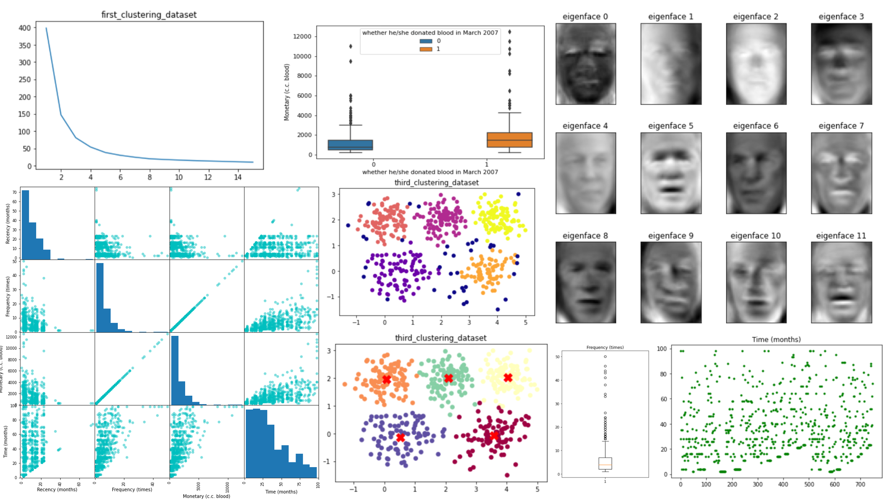

##  Data Mining Assignments (Classification, Clustering, MLP)

## Table of Contents

- [Assignment1: Blood Donation Analysis](#assignment1)
- [Assignment2 - Part1: Maternal Health Risk Analysis](#assignment2---part1)
- [Assignment2 - Part2: Speech Features Classification](#assignment2---part2)
- [Assignment3 - Part1: Facial Recognition with PCA and MLP](#assignment3---part1)
- [Assignment3 - Part2: Clustering Analysis with K-Means, Fuzzy C-Means, and DBSCAN](#assignment3---part2)

# Assignment1

## Project Description
This project, focuses on analyzing a dataset related to blood donation. The dataset is named "transfusion.data" and contains information about individuals' blood donation history, including factors like recency, frequency, monetary donations, time since the last donation, and whether they donated blood in March 2007. 

---
# Assignment2 - Part1
## Project Overview
This project involves the analysis of maternal health risk data using various machine learning algorithms. The primary goal is to build predictive models for risk assessment based on the provided dataset named "Maternal Health Risk Data Set.csv."

## Project Components

### 1. Data Preprocessing
#### 1.1. Feature Selection
A subset of relevant features is selected and stored in a new DataFrame named `new_data_frame`. This subset includes columns 0 to 5 from the original dataset.

#### 1.2. Encoding Target Variable
The target variable, representing maternal health risk levels, is encoded into numerical values as follows:
- 'low risk' is encoded as 0
- 'mid risk' is encoded as 1
- 'high risk' is encoded as 2

### 2 Train-Test Split
The dataset is split into training and test sets. Approximately 70% of the data is used for training, and 30% is reserved for testing. Random indices are selected to achieve this split.

### 3. Model Building and Evaluation
The project employs several machine learning algorithms for modeling and evaluation. Each algorithm is explored with different parameter settings.
- Decision Tree
- K-Nearest Neighbors (KNN)
- Support Vector Machine (SVM)
- Random Forest
  
### 4. Model Evaluation Metrics
For each model, the following evaluation metrics are calculated:
- Accuracy on the test set
- Accuracy on the training set
- Cross-validation score (average accuracy)
- Confusion matrix
---
# Assignment2 - Part2

## Project Overview
This project involves the analysis of speech features data for the classification of speech disorders. The primary objective is to build and evaluate machine learning models to classify speech samples into two categories: healthy (1) and speech disorders (0). The dataset used for this project is named "pd_speech_features.csv." 

## Project Components

### 1. Data Preprocessing
#### 1.1. Feature Selection
A subset of relevant features is selected and stored in a new DataFrame named `new_data_frame`. This subset includes all columns except the first one, which is assumed to be an identifier.

#### 1.2. Train-Test Split
The dataset is divided into a training set and a test set. Approximately 70% of the data is used for training, and 30% is set aside for testing. Randomly selected rows are used for each split.

#### 1.3. Encoding Target Variable
The target variable, representing the classification labels, is encoded as follows:
- Healthy speech (Class 1) is encoded as 1.
- Speech disorders (Class 0) are encoded as 0.

### 2. Model Building and Evaluation
Machine learning models are built and evaluated using the training and test datasets. Three types of models are explored: Decision Trees, K-Nearest Neighbors (KNN), Support Vector Machines (SVM), and Random Forests. Different parameter settings are tested for each model.

### 3. Model Evaluation Metrics
For each model, the following evaluation metrics are calculated:
- Accuracy on the test set
- Accuracy on the training set
- Cross-validation score (average accuracy)
- Confusion matrix
-----------------
# Assignment3 - Part1
# Facial Recognition with PCA and MLP Classifier

## Overview
This project demonstrates facial recognition using Principal Component Analysis (PCA) and a Multi-Layer Perceptron (MLP) Classifier. The goal is to find the optimal number of PCA components that result in the highest accuracy for classifying faces in the LFW dataset. The project uses scikit-learn for data manipulation, dimensionality reduction, and machine learning tasks.

## Requirements
Before running the project, ensure you have the following Python libraries installed:
- numpy
- pandas
- scikit-learn (specifically, fetch_lfw_people, PCA, MLPClassifier, and confusion_matrix)
- random

## Usage
1. **Load Data:**
   - The project begins by loading the LFW (Labeled Faces in the Wild) dataset, which contains facial images.
   - Minimum faces per person and image resizing options are applied to filter the dataset.
   - The data is then stored in a Pandas DataFrame for further processing.

2. **Principal Component Analysis (PCA):**
   - Principal Component Analysis is applied to reduce the dimensionality of the data.
   - The `pc` function takes an argument `a` for the number of components to retain.
   - The function returns a DataFrame containing the data after PCA transformation.

3. **Splitting Data:**
   - The dataset is split into training and testing sets.
   - A random sample of 25% of the data is selected for testing, and the rest is used for training.

4. **Model Training and Evaluation:**
   - The MLPClassifier (Multi-Layer Perceptron) is used for face recognition.
   - The project iterates through different numbers of PCA components (from 10 to 79) to find the best accuracy.
   - For each number of components:
     - Data is transformed using PCA.
     - The transformed data is split into training and testing sets.
     - An MLP Classifier is trained on the training data.
     - Predictions are made on the testing data.
     - The accuracy of the model is calculated and printed.
     - The best accuracy and corresponding predictions are stored.

5. **Best Component Selection:**
   - After running the model for various numbers of PCA components, the project identifies the best count of components with the highest accuracy.

6. **Confusion Matrix:**
   - Finally, a confusion matrix is generated to evaluate the model's performance.
   - The confusion matrix shows the number of true positives, true negatives, false positives, and false negatives.

--------------------
# Assignment3 - Part2

# Clustering Analysis with K-Means, Fuzzy C-Means, and DBSCAN

## Overview

This project explores clustering analysis using different techniques such as K-Means, Fuzzy C-Means, and DBSCAN on three distinct datasets. The goal is to discover meaningful patterns and groupings within the data. The project utilizes Python libraries like pandas, matplotlib, scikit-learn, numpy, and the fcmeans package.

## Data Loading

The project begins by loading three different datasets:
1. "first_clustering_dataset.csv"
2. "second_clustering_dataset.csv"
3. "third_clustering_dataset.csv"

Each dataset contains two-dimensional data points.

## K-Means Clustering

The project utilizes K-Means clustering to group data points into clusters. The `KMEANS` function is defined to perform K-Means clustering with the following steps:

1. Initialize a K-Means model with a specified number of clusters (`number_of_clusters`) and random initialization repetitions (`random_c`).
2. Fit the model to the data.
3. Visualize the clustered data points along with centroids.
4. Calculate the Sum of Squared Errors (SSE) and silhouette score for evaluating clustering quality.

The `KMEANS` function is applied to each dataset with different cluster counts:

- For **"first_clustering_dataset"** (K=2):
  - SSE: 146.90
  - Silhouette Score: 0.536

- For **"second_clustering_dataset"** (K=3):
  - SSE: 6481.46
  - Silhouette Score: 0.723

- For **"third_clustering_dataset"** (K=5):
  - SSE: 222.20
  - Silhouette Score: 0.560

## Fuzzy C-Means Clustering

Fuzzy C-Means (FCM) clustering is applied to the datasets to allow data points to belong to multiple clusters with varying degrees of membership. The `fcm_func` function is defined to perform FCM clustering with the following steps:

1. Initialize an FCM model with a specified number of clusters (`number_of_cluster`).
2. Fit the model to the data.
3. Visualize the clustered data points along with cluster centers.
4. Calculate the SSE and silhouette score for evaluating clustering quality.

The `fcm_func` function is applied to each dataset with different cluster counts:

- For **"first_clustering_dataset"** (K=2):
  - SSE: 146.97
  - Silhouette Score: 0.536

- For **"second_clustering_dataset"** (K=3):
  - SSE: 6483.79
  - Silhouette Score: 0.723

- For **"third_clustering_dataset"** (K=5):
  - SSE: 222.70
  - Silhouette Score: 0.560

## DBSCAN Clustering

DBSCAN (Density-Based Spatial Clustering of Applications with Noise) clustering is applied to the datasets. DBSCAN does not require specifying the number of clusters in advance but identifies clusters based on data density. The `dbscan_func` function is defined to perform DBSCAN clustering with the following steps:

1. Initialize a DBSCAN model with specified parameters (`v_eps` for epsilon and `v_min_samples` for minimum samples).
2. Fit the model to the data.
3. Visualize the clustered data points.

The `dbscan_func` function is applied to each dataset with different parameters:

- For **"first_clustering_dataset"** (eps=0.25, min_samples=10):
  - Silhouette Score: 0.521

- For **"second_clustering_dataset"** (eps=6, min_samples=2):
  - Silhouette Score: 0.723

- For **"third_clustering_dataset"** (eps=0.39, min_samples=10):
  - Silhouette Score: 0.510

